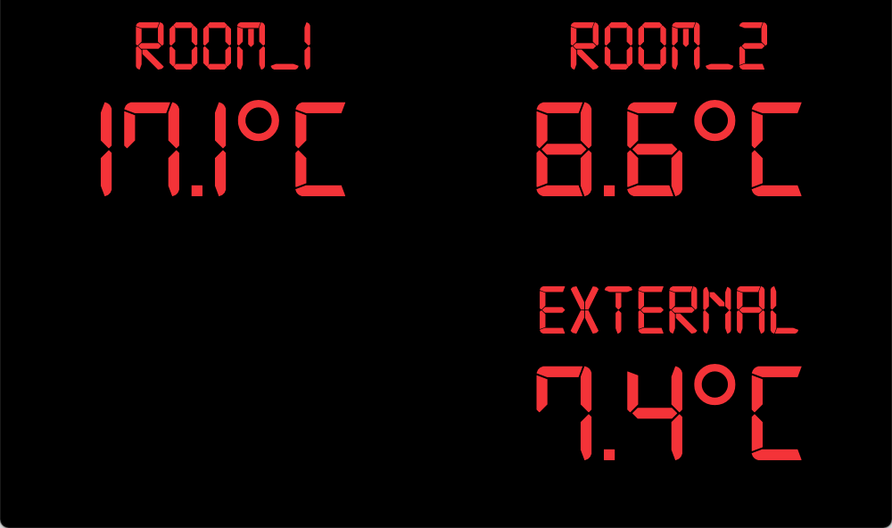

# TemperatureCenter

[](https://travis-ci.com/mlsmrc/TemperatureCenter)

## Web server
Running webserver with command below:

```
 docker run -p 8080:80 theoriginaltonystark/temperaturecenter_web-server:latest
```

### Web interface

This is the web interface build to visualize the temperatures. It has been build specifically for Raspberry Pi screen.

