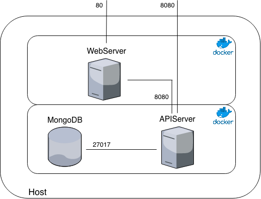

# Temperature Center

The goal of this project is building a temperature/humidity center embedded into a Rasperry PI 3 with touch screen controls.

## Idea

The main idea is having some external sensors (i.e. Arduino based) which send data (humidity / temperature) to the temperature center device.

It will show them into a Rasperry PI display.

## Diagram

The soluction has (for now) three main components:

* the web-server, which is exposed into the touch screen
* the api-server, which interact (privately) with the database and with the web-server and the external sensors.

## Next implementation

- [ ] Backup system
- [ ] Data visualization for each location
- [ ] Homekit implementation
- [ ] Data feed for monthly data progression
